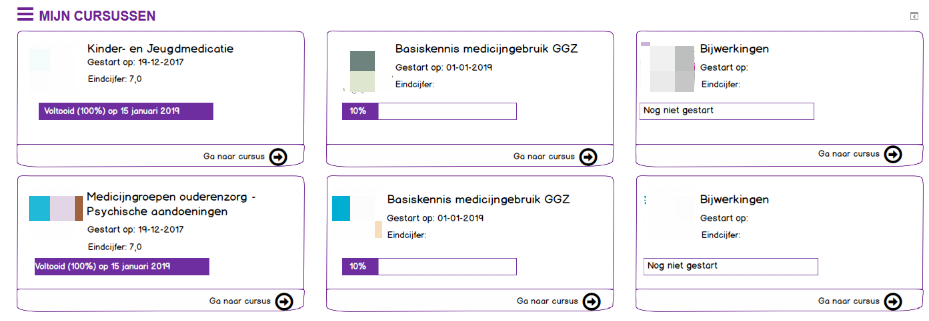

## Moodle block for listing user their active courses

In brief, the MFreak block `block_mycoursesltc` gives the user an overview of their active courses.
 
 Special thanks to Gemma Lesterhuis ([Lesterhuis Training & Consultancy](https://ltnc.nl/)) for develop & design, useful input, bug reports and beta testing
 

* Author: Luuk Verhoeven, [MFreak.nl](https://MFreak.nl/)
* Author: Gemma Lesterhuis, [Lesterhuis Training & Consultancy](https://ltnc.nl/)

* Min. required: Moodle 3.9.*
* Supports PHP: 7.2 

## Screens

## List of features
- Overview of your active courses
- GDPR
- Mustache templates
- Default course image
- Display course grade
- Display completion percentage

## Installation
1.  Copy this plugin to the `blocks\mycoursesltc` folder on the server
2.  Login as administrator
3.  Go to Site Administrator > Notification
4.  Install the plugin

## Security

If you discover any security related issues, please email [luuk@MFreak.nl](mailto:luuk@MFreak.nl) instead of using the issue tracker.

## License

The GNU GENERAL PUBLIC LICENSE. Please see [License File](LICENSE.md) for more information.

## Contributing

Contributions are welcome and will be fully credited. We accept contributions via Pull Requests on Github.